# **一刀両断**
### 河原電子ビジネス専門学校
### ゲームクリエイター科2年　錦織隼王

# **目次**
### 1. [作品概要](#overview)
### 2. [操作説明](#operation)
### 3. [担当ソースコード](#responsible)
### 4. [改造したエンジンのコード](#enginecode)
### 5. [メッシュの切断](#meshcut)
### 5. [こだわった部分](#commitment)

# **1. 作品概要**
* ## 一刀両断
    *ゲーム説明*  
    <!--
    動画挿入
    <iframe width="640" height="365" src="https://www.youtube.com/embed/kX87_XVBVlo" title="YouTube video player" frameborder="0" allow="accelerometer; autoplay; clipboard-write; encrypted-media; gyroscope; picture-in-picture" allowfullscreen></iframe>  
    -->

    **紹介動画**
* ## 使用ゲームエンジン
    学校内製エンジンを改造して使用
* ## 使用ツール
    Visual Studio 2019  
    Visual Studio Code  
    3ds Max 2021  
    Adobe Photoshop Elements 2020  
    Git
* ## 使用言語
    C++  
    HLSL
* ## 使用ライブラリ
    BulletPhysics  
    EffekSeer  
    DirectXTK12
* ## 開発環境
    Windows10  
    DirectX12
* ## 制作人数
    1人
* ## 開発期間
    2021年9月～

# **2. 操作説明**
*操作説明*  
<!--
   
-->

# **3. 担当ソースコード**  

担当ソースコード(クリックで開閉)

* AnimationState.cpp  
* AnimationState.h  
* AttackTutorial.cpp  
* AttackTutorial.h  
* AxisCalculator.cpp  
* AxisCalculator.h  
* BackGround.cpp  
* BackGround.h  
* BossTank.cpp  
* BossTank.h  
* BossTankBehave.cpp  
* BossTankBehave.h  
* BossTankCollision.cpp  
* BossTankCollision.h  
* BossTankDisplay.cpp  
* BossTankDisplay.h  
* BossTankFinishCommand.cpp  
* BossTankFinishCommand.h  
* BossTankStatus.h  
* BossTankTasks.cpp  
* BossTankTasks.h  
* CommandInput.cpp  
* CommandInput.h  
* CutDummy.cpp  
* CutDummy.h  
* CutSurfaceMaker.cpp  
* CutSurfaceMaker.h  
* DashTutorial.cpp  
* DashTutorial.h  
* DirectionLight.cpp  
* DirectionLight.h  
* Door.cpp  
* Door.h  
* EnemyMisile.cpp  
* EnemyMissile.h  
* EnemyMissileMove.cpp  
* EnemyMissileMove.h  
* EnemyMissileRotation.cpp  
* EnemyMissileRotation.h  
* EnemyRock.cpp  
* EnemyRock.h  
* EnemyTask.cpp  
* EnemyTask.h  
* Explosion.cpp  
* Explosion.h  
* Fade.cpp  
* Fade.h  
* FontRender.cpp  
* FontRender.h  
* GameOverNotifier.cpp  
* GameOverNotifier.h  
* GameScene.cpp  
* GameScene.h  
* GameSceneBGM.cpp  
* GameSceneBGM.h  
* HealItem.cpp  
* HealItem.h  
* ITriangleMaker.h  
* LightManager.cpp  
* LightManager.h  
* MeshDivider.cpp  
* MeshDivider.h  
* MiniEnemy.cpp  
* MiniEnemy.h  
* ModelCutManager.cpp  
* ModelCutManager.h  
* OneOnPlaneTriangle.cpp  
* OneOnPlaneTriangle.h  
* Player.cpp  
* Player.h  
* PlayerAnimation.cpp  
* PlayerAnimation.h
* PlayerAnimationInitializer.cpp  
* PlayerAnimationInitializer.h  
* PlayerAnimationParam.h  
* PlayerAttack.cpp  
* PlayerAttack.h  
* PlayerAttackAnimationState.cpp  
* PlayerAttackAnimationState.h  
* PlayerAttackSound.cpp  
* PlayerAttackSound.h  
* PlayerCamera.cpp  
* PlayerCamera.h  
* PlayerCut.cpp  
* PlayerCut.h  
* PlayerDisplay.cpp  
* PlayerDisplay.h  
* PlayerMove.cpp  
* PlayerMove.h  
* PlayerMoveAnimationState.cpp  
* PlayerMoveAnimationState.h  
* PointLight.cpp  
* PointLight.h  
* ProductsDeleter.cpp  
* ProductsDeleter.h  
* RenderingEngine.cpp  
* RenderingEngine.h  
* ShadowRender.cpp  
* ShadowRender.h  
* SkinModelRender.cpp  
* SkinModelRender.h  
* SpotLight.cpp  
* SpotLight.h  
* SpriteRender.cpp  
* SpriteRender.h  
* StepObject.cpp  
* StepObject.h  
* ThreeOnBackTriangle.cpp  
* ThreeOnBackTriangle.h  
* ThreeOnFrontTriangle.cpp  
* ThreeOnFrontTriangle.h  
* ThreeOnPlaneTriangle.cpp  
* ThreeOnPlaneTriangle.h  
* TitleDoor.cpp  
* TitleDoor.h  
* TitleScene.cpp  
* TitleScene.h  
* TriangleDivider.cpp  
* TriangleDivider.h  
* TriangleDividerStruct.h  
* TriangleMakerHeader.h  
* TwoDTriangulate.cpp  
* TwoDTriangulate.h  
* TwoOnBackTriangle.cpp  
* TwoOnBackTriangle.h  
* TwoOnFrontTriangle.cpp  
* TwoOnFrontTriangle.h  

# **4. 改造したエンジンのコード**

改造したエンジンのコード(クリックで開閉)

* GameObjectManager.cpp、GameObjectManager.h  
スプライト用の描画ステップを追加  
* GraphicsEngine.cpp  
FPSの固定処理を追加
* IGameObject.h  
ゲームオブジェクトに紐付けられたモデルが切断された際に呼ばれる関数を追加  
* Material.cpp、Material.h  
シェーダーにリソースバンクを使用するよう変更
* Model.cpp、Model.h  
モデルの分割関数を追加  
モデルのコピー関数を追加    
* TkmFile.cpp、TkmFile.h  
モデルの分割関数を追加  
マテリアルのコピー関数を追加  
頂点の線形補間関数を追加  
メッシュを直に追加する関数を追加
* Vector.h  
ベクトル型を連想配列に追加できるように各要素の値をハッシュ値に変換し、  
その値を比較することによる比較演算子の追加  
4次元ベクトルの線形補完関数の追加  

# **5. メッシュ切断** 

# シーケンス図による全体の流れ  
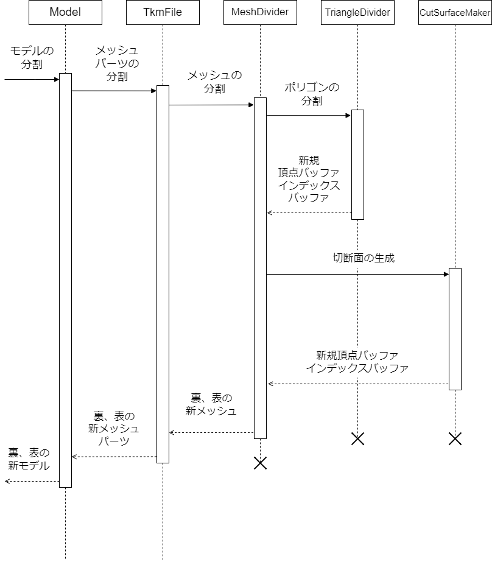   

# 各手順の詳細  

今回切断の判定に使用する切断面は、  
切断面上の一点の座標と切断面の法線ベクトルで表現する。  

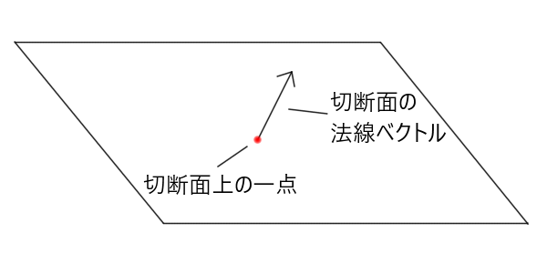   

## 手順1.切断準備_切断面の座標系の変換  
モデルの切断に使用する頂点バッファはモデル内部にローカル座標系で保存されており、  
モデルを表示する際にワールド行列を乗算してワールド座標に変換されているため、  
切断面の座標をワールド座標のままモデルに渡してしまうと、  
正常に切断の判定ができない。  

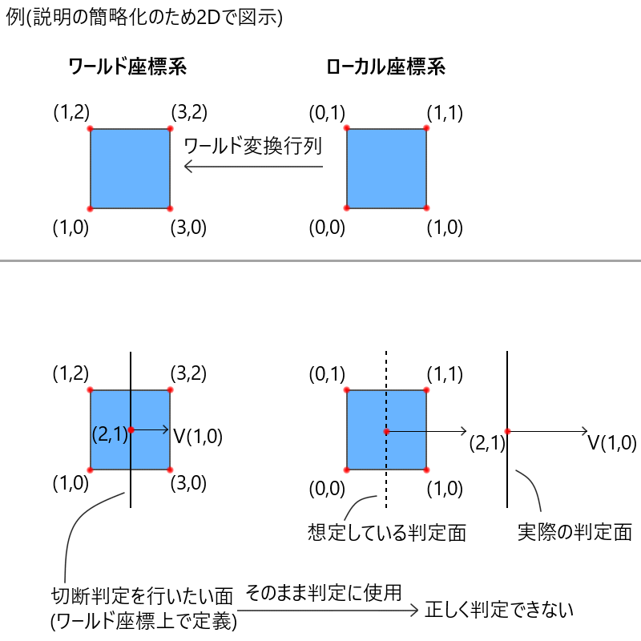  

正常に切断の判定をするには、切断するモデルのローカル座標上に切断面を移す必要がある。  
そのため、モデルのワールド行列の逆行列を乗算する。  
切断面の法線ベクトルにそのまま乗算すると結果がおかしくなるため、  
切断面の一点、切断面の一点から切断面の向きへのベクトルを足した一点
のそれぞれにワールド行列の逆行列を乗算し、ローカル座標での切断面の向きを計算する。  
  
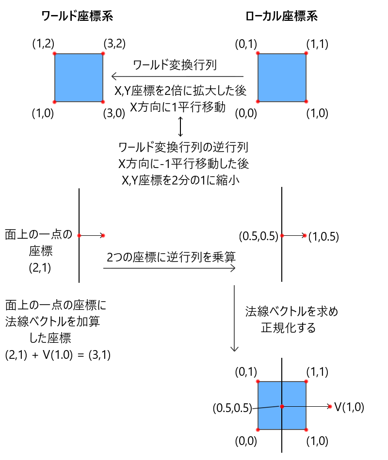  

## 手順2.切断単位の説明  

エンジンにある、モデルを構成する頂点バッファ、インデックスバッファ、マテリアルなどのメッシュ情報を保持する  
TkmFileクラス内で、分割を行う。  
モデルを構成するインデックスバッファがマテリアルごとに分かれているため、マテリアルごとに切断を行う。  
切断の最小単位として、メッシュを構成するポリゴンごとに切断を行う。

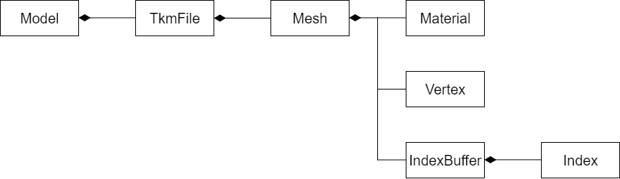  
  
## 手順3.ポリゴンごとの分割準備  
マテリアルごとに用意されたインデックスバッファの配列を順番に見ていく。  
0番目のインデックスバッファから走査  
今回モデルのポリゴンは3頂点で構成されているため、インデックスバッファの中を3要素ずつ見ていく。  

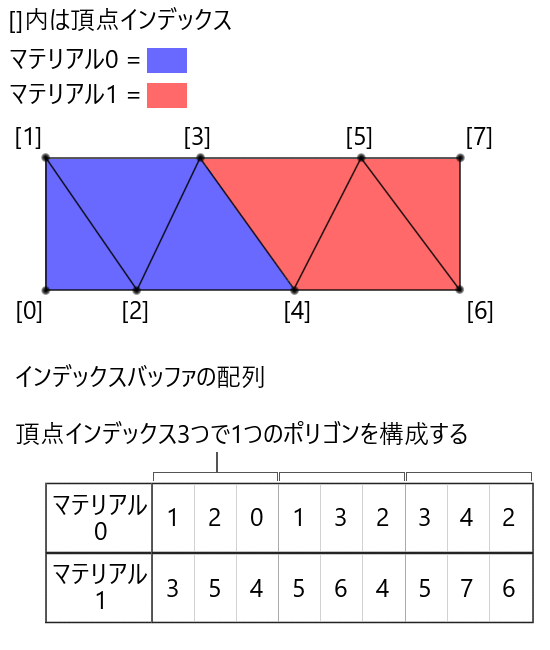  
  
## 手順4.ポリゴンの分割  
TriangleDividerクラスで行われる。  
切断面の法線ベクトルの方向を切断面の表側とし、  
ポリゴンを構成する3点が、切断面の裏・表・切断面上のどこに位置するかを調べる。  
  
切断面上の一点から、位置を判定したい点へのベクトルを正規化したベクトルを求める。  
そのベクトルと、切断面の法線ベクトルとの内積を計算する。  
内積の結果が0より大きい-切断面の表側に点がある。  
内積の結果が0より小さい-切断面の裏側に点がある。  
内積の結果が0-切断面上に点がある。  
  
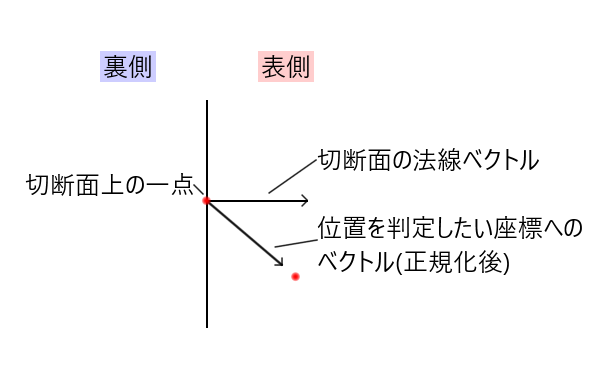 

計算結果に従い、3点を裏・表・切断面上にグループ分けする。  
グループ分けの結果によって、ポリゴンがどう分割されているかを判定する。  
  
考えられるパターン  
表側に頂点があり、裏側に頂点がない 　-①　非分割  
裏側に頂点があり、表側に頂点がない 　-②　非分割  
表側に頂点が2つ、裏側に頂点が1つ 　　-③　分割  
裏側に頂点が2つ、表側に頂点が1つ 　　-④　分割  
表側、裏側、面上にそれぞれ頂点が1つ　-⑤　分割  
面上に頂点が3つある　　　　　　　　　-⑥　特殊(※どちら側にも3頂点があるとして扱う)  

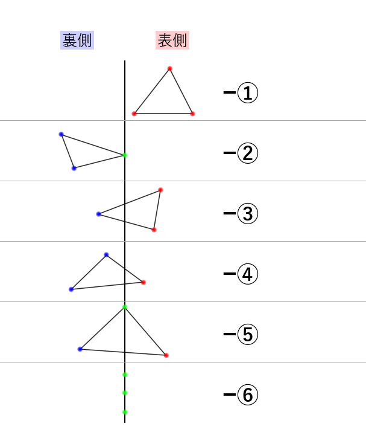  
  
ポリゴンが分割されていると判定された場合、表側の点と裏側の点を結んだ線分と切断面の交差地点を求め、  
新たな頂点バッファを作成する。  
  
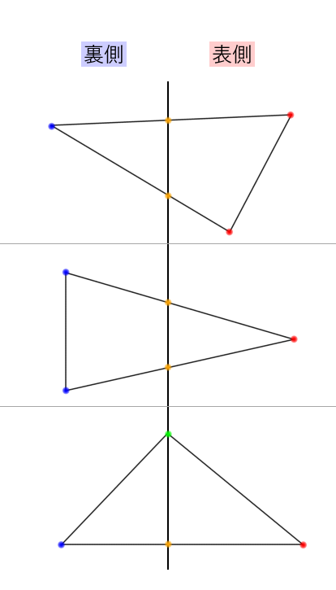  

分割の際には、後の切断面生成に備え、ポリゴンと切断面の交差地点上にある2つの頂点インデックスを1組のペアとして、集合に格納しておく。  

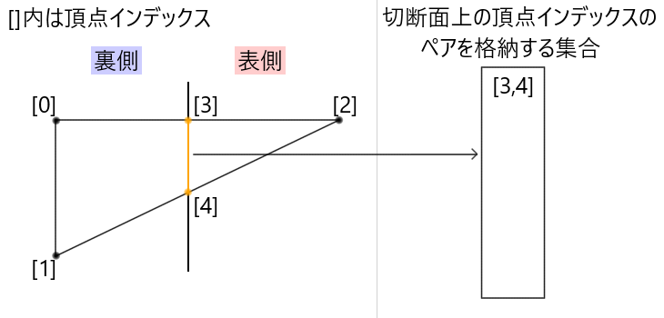   
  
パターンに合わせて適切に表側、裏側のインデックスバッファに分割後のポリゴンの頂点インデックスを挿入するTriangleMakerクラスの関数を呼び出す。  
TriangleMakerクラスは、パターンの見落としや、新しいパターンが増えた時のために、  
抽象クラスであるITriangleMakerを継承して作成している。  

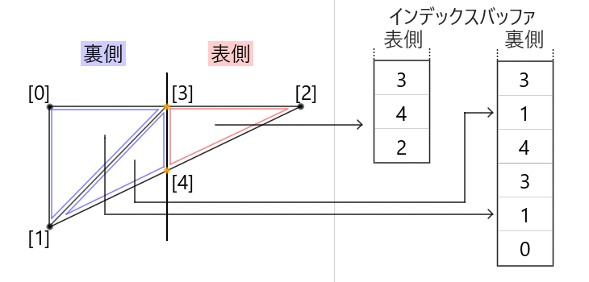   

1つのマテリアル分のポリゴンに対して分割処理を繰り返す。  
分割の結果マテリアルのインデックスバッファのサイズが0になった場合、マテリアルを削除する。  
1マテリアル分が終われば次のマテリアル分のポリゴンに対して分割処理を行う。  

## 手順5.切断面の生成
全マテリアル分のポリゴンの分割が終わると、切断面の生成に入る。

まず、切断面を生成する際、切断面を構成する頂点バッファを新しく作成する必要がある。  
新しく作成する頂点バッファは、座標自体はポリゴンの分割の時に得られた切断面上にある頂点と同じなので、  
作成された頂点インデックスのペアの集合を使用する。  

まず、頂点インデックスのペアの集合を走査し、  
切断面上にある頂点の座標を新しく可変長配列に格納していく。
その後、頂点インデックスのペアを、頂点バッファの配列の何番目にあるか  
という情報から、切断面上にある頂点座標の可変長配列の何番目にあるか  
という情報に変換する。

*説明画像*  

その後リンクを作成する。(加筆)

その後、2D空間に変換する(加筆)

その後、リンクができている頂点群に対して、
多角形の三角形分割を行い、切断面を構成する3点が、  
切断面上にある頂点座標の可変長配列の何番目かを取得する。  

取得した座標を元に、頂点バッファを作成する。
切断面の表側の頂点バッファの法線は切断面の法線を反転させたもの、  
切断面の裏側の頂点バッファの法線は切断面の法線を使用する。

