# **一刀両断**
### 河原電子ビジネス専門学校
### ゲームクリエイター科2年　錦織隼王

# **目次**
### 1. [作品概要](#overview)
### 2. [操作説明](#operation)
### 3. [担当ソースコード](#responsible)
### 4. [改造したエンジンのコード](#enginecode)
### 5. [メッシュの切断](#meshcut)
### 6. [ディザリング透過](#dithering)
### 7. [こだわった部分](#commitment)

# **1. 作品概要**
* ## 一刀両断  
侍を操作し、扉に敵にミサイルに、  
すべてを斬り伏せながら進んでいくゲームです。  
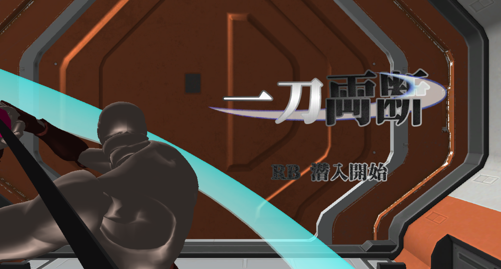   
* ## 使用ゲームエンジン
    学校内製エンジンを改造して使用
* ## 使用ツール
    Visual Studio 2019  
    Visual Studio Code  
    3ds Max 2021  
    Adobe Photoshop Elements 2020  
    Git
* ## 使用言語
    C++  
    HLSL
* ## 使用ライブラリ
    BulletPhysics  
    EffekSeer  
    DirectXTK12
* ## 開発環境
    Windows10  
    DirectX12
* ## 制作人数
    1人
* ## 開発期間
    2021年9月～

# **2. 操作説明**  
  
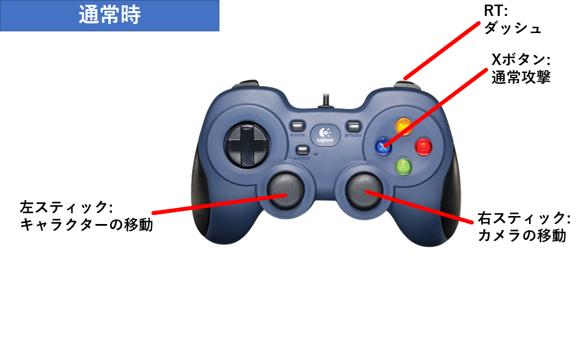  

 

  
  

# **3. 担当ソースコード**  

担当ソースコード(クリックで開閉)

* AnimationState.cpp  
* AnimationState.h  
* AttackTutorial.cpp  
* AttackTutorial.h  
* AxisCalculator.cpp  
* AxisCalculator.h  
* BackGround.cpp  
* BackGround.h  
* BossTank.cpp  
* BossTank.h  
* BossTankBehave.cpp  
* BossTankBehave.h  
* BossTankCollision.cpp  
* BossTankCollision.h  
* BossTankDisplay.cpp  
* BossTankDisplay.h  
* BossTankFinishCommand.cpp  
* BossTankFinishCommand.h  
* BossTankStatus.h  
* BossTankTasks.cpp  
* BossTankTasks.h  
* CommandInput.cpp  
* CommandInput.h  
* CutDummy.cpp  
* CutDummy.h  
* CutSurfaceMaker.cpp  
* CutSurfaceMaker.h  
* DashTutorial.cpp  
* DashTutorial.h  
* DirectionLight.cpp  
* DirectionLight.h  
* Door.cpp  
* Door.h  
* EnemyMisile.cpp  
* EnemyMissile.h  
* EnemyMissileMove.cpp  
* EnemyMissileMove.h  
* EnemyMissileRotation.cpp  
* EnemyMissileRotation.h  
* EnemyRock.cpp  
* EnemyRock.h  
* EnemyTask.cpp  
* EnemyTask.h  
* Explosion.cpp  
* Explosion.h  
* Fade.cpp  
* Fade.h  
* FontRender.cpp  
* FontRender.h  
* GameOverNotifier.cpp  
* GameOverNotifier.h  
* GameScene.cpp  
* GameScene.h  
* GameSceneBGM.cpp  
* GameSceneBGM.h  
* HealItem.cpp  
* HealItem.h  
* ITriangleMaker.h  
* LightManager.cpp  
* LightManager.h  
* MeshDivider.cpp  
* MeshDivider.h  
* MiniEnemy.cpp  
* MiniEnemy.h  
* ModelCutManager.cpp  
* ModelCutManager.h  
* OneOnPlaneTriangle.cpp  
* OneOnPlaneTriangle.h  
* Player.cpp  
* Player.h  
* PlayerAnimation.cpp  
* PlayerAnimation.h
* PlayerAnimationInitializer.cpp  
* PlayerAnimationInitializer.h  
* PlayerAnimationParam.h  
* PlayerAttack.cpp  
* PlayerAttack.h  
* PlayerAttackAnimationState.cpp  
* PlayerAttackAnimationState.h  
* PlayerAttackSound.cpp  
* PlayerAttackSound.h  
* PlayerCamera.cpp  
* PlayerCamera.h  
* PlayerCut.cpp  
* PlayerCut.h  
* PlayerDisplay.cpp  
* PlayerDisplay.h  
* PlayerMove.cpp  
* PlayerMove.h  
* PlayerMoveAnimationState.cpp  
* PlayerMoveAnimationState.h  
* PointLight.cpp  
* PointLight.h  
* ProductsDeleter.cpp  
* ProductsDeleter.h  
* RenderingEngine.cpp  
* RenderingEngine.h  
* ShadowRender.cpp  
* ShadowRender.h  
* SkinModelRender.cpp  
* SkinModelRender.h  
* SpotLight.cpp  
* SpotLight.h  
* SpriteRender.cpp  
* SpriteRender.h  
* StepObject.cpp  
* StepObject.h  
* ThreeOnBackTriangle.cpp  
* ThreeOnBackTriangle.h  
* ThreeOnFrontTriangle.cpp  
* ThreeOnFrontTriangle.h  
* ThreeOnPlaneTriangle.cpp  
* ThreeOnPlaneTriangle.h  
* TitleDoor.cpp  
* TitleDoor.h  
* TitleScene.cpp  
* TitleScene.h  
* TriangleDivider.cpp  
* TriangleDivider.h  
* TriangleDividerStruct.h  
* TriangleMakerHeader.h  
* TwoDTriangulate.cpp  
* TwoDTriangulate.h  
* TwoOnBackTriangle.cpp  
* TwoOnBackTriangle.h  
* TwoOnFrontTriangle.cpp  
* TwoOnFrontTriangle.h  

# **4. 改造したエンジンのコード**

改造したエンジンのコード(クリックで開閉)

* GameObjectManager.cpp、GameObjectManager.h  
スプライト用の描画ステップを追加  
* GraphicsEngine.cpp  
FPSの固定処理を追加
* IGameObject.h  
ゲームオブジェクトに紐付けられたモデルが切断された際に呼ばれる関数を追加  
* Material.cpp、Material.h  
シェーダーにリソースバンクを使用するよう変更
* Model.cpp、Model.h  
モデルの分割関数を追加  
モデルのコピー関数を追加    
* TkmFile.cpp、TkmFile.h  
モデルの分割関数を追加  
マテリアルのコピー関数を追加  
頂点の線形補間関数を追加  
メッシュを直に追加する関数を追加
* Vector.h  
ベクトル型を連想配列に追加できるように各要素の値をハッシュ値に変換し、  
その値を比較することによる比較演算子の追加  
4次元ベクトルの線形補完関数の追加  

# **5. メッシュ切断** 

技術的な挑戦として、モデル内のメッシュを分割する  
メッシュ切断を実装した。  

<iframe width="640" height="365" src="https://www.youtube.com/embed/b5prSEbxukI?rel = 0" title="YouTube video player" frameborder="0" allow="accelerometer; autoplay; clipboard-write; encrypted-media; gyroscope; picture-in-picture" allowfullscreen></iframe>  

# シーケンス図による全体の流れ  
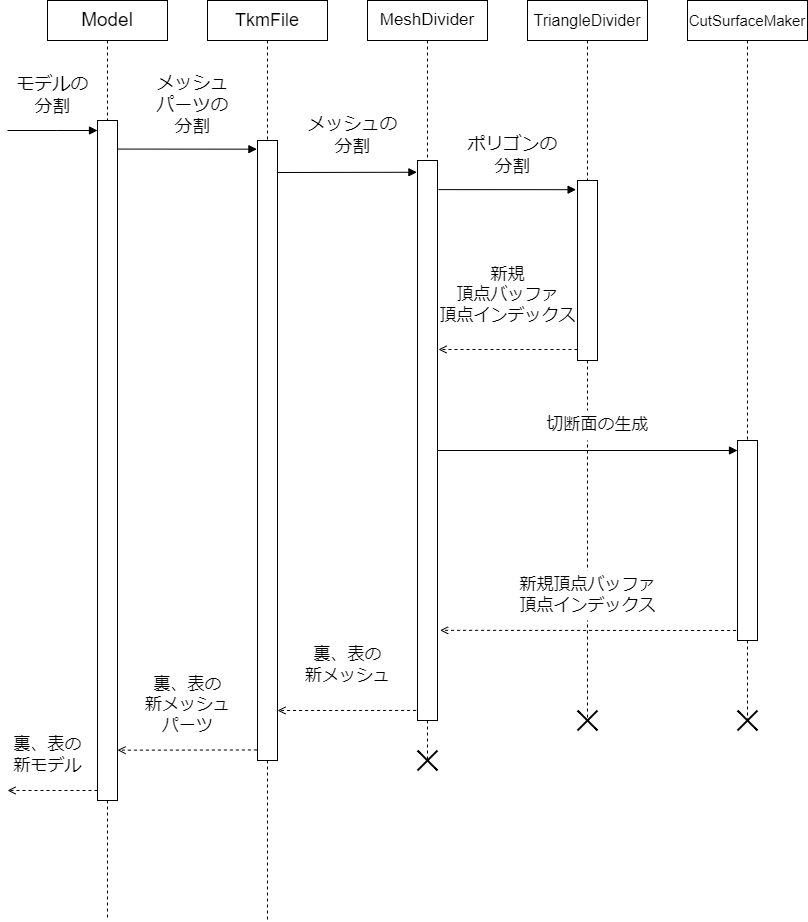   

# 各手順の詳細  

今回切断の判定に使用する切断面は、  
切断面上の一点の座標と切断面の法線ベクトルで表現する。  

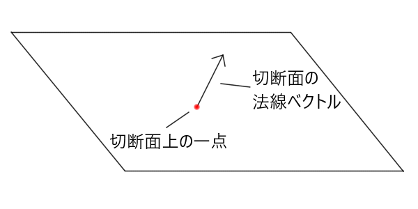   

## 手順1.切断準備_切断面の座標系の変換  
モデルの切断に使用する頂点バッファはモデル内部にローカル座標系で保存されており、  
モデルを表示する際にワールド行列を乗算してワールド座標に変換されているため、  
切断面の座標をワールド座標のままモデルに渡してしまうと、  
正常に切断の判定ができない。  

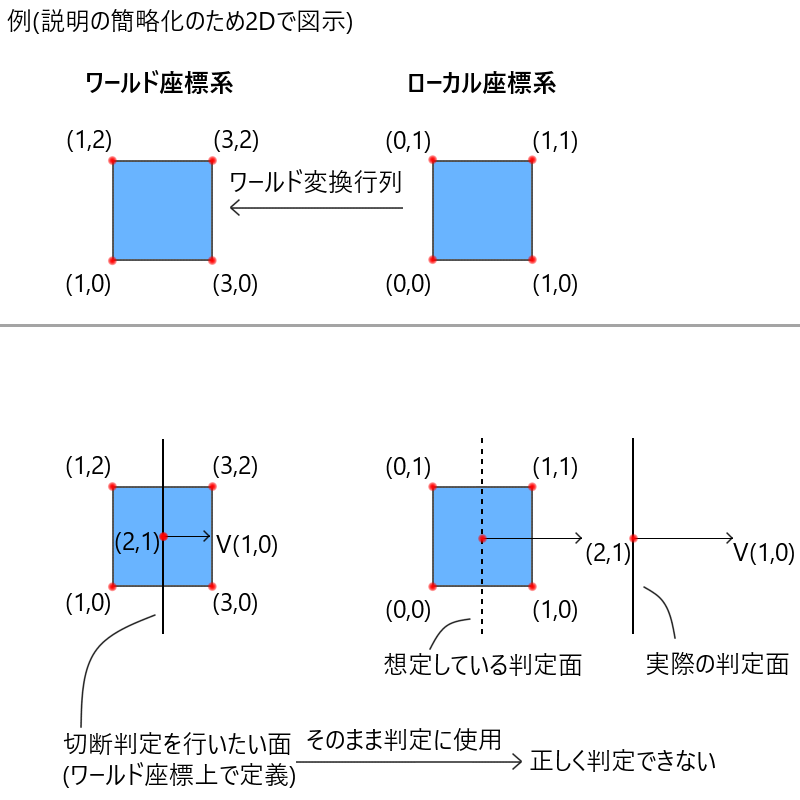  

正常に切断の判定をするには、切断するモデルのローカル座標上に切断面を移す必要がある。  
そのため、モデルのワールド行列の逆行列を乗算する。  
切断面の法線ベクトルにそのまま乗算すると結果がおかしくなるため、  
切断面の一点、切断面の一点から切断面の向きへのベクトルを足した一点
のそれぞれにワールド行列の逆行列を乗算し、ローカル座標での切断面の向きを計算する。  
  
  

## 手順2.切断単位の説明  

エンジンにある、モデルを構成する頂点バッファ、インデックスバッファ、マテリアルなどのメッシュ情報を保持する  
TkmFileクラス内で、分割を行う。  
モデルを構成するインデックスバッファがマテリアルごとに分かれているため、マテリアルごとに切断を行う。  
切断の最小単位として、メッシュを構成するポリゴンごとに切断を行う。

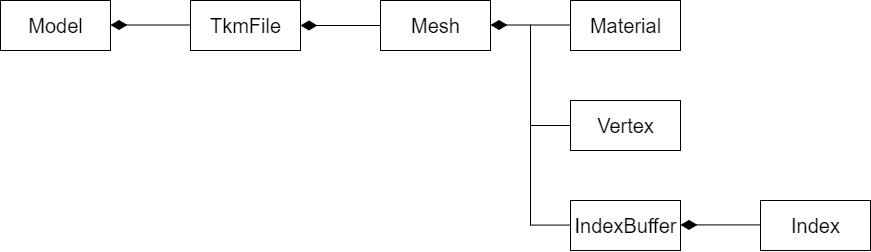  
  
## 手順3.ポリゴンごとの分割準備  
マテリアルごとに用意されたインデックスバッファの配列を順番に見ていく。  
0番目のインデックスバッファから走査する。  
今回モデルのポリゴンは3頂点で構成されているため、インデックスバッファの中を3要素ずつ見ていく。  

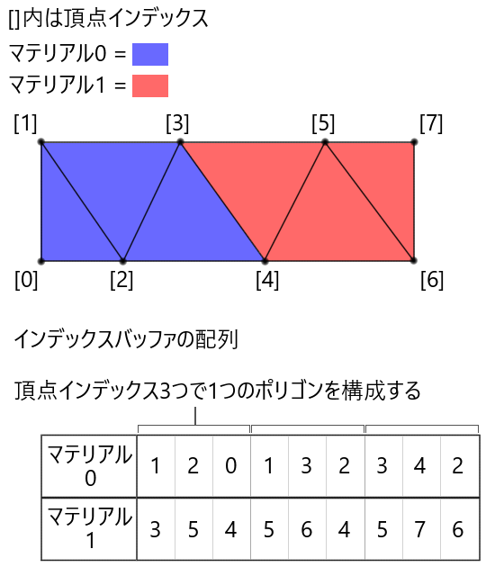  
  
## 手順4.ポリゴンの分割  
TriangleDividerクラスで行われる。  
切断面の法線ベクトルの方向を切断面の表側とし、  
ポリゴンを構成する3点が、切断面の裏・表・切断面上のどこに位置するかを調べる。  
  
切断面上の一点から、位置を判定したい点へのベクトルを正規化したベクトルを求める。  
そのベクトルと、切断面の法線ベクトルとの内積を計算する。  
内積の結果が0より大きい-切断面の表側に点がある。  
内積の結果が0より小さい-切断面の裏側に点がある。  
内積の結果が0-切断面上に点がある。  
  
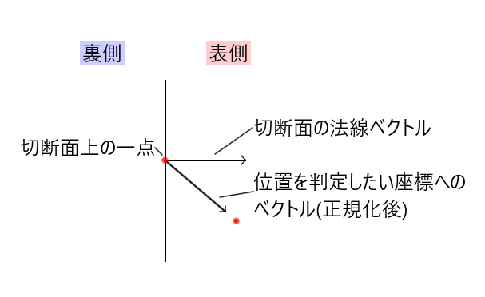 

計算結果に従い、3点を裏・表・切断面上にグループ分けする。  
グループ分けの結果によって、ポリゴンがどう分割されているかを判定する。  
  
考えられるパターン  
表側に頂点があり、裏側に頂点がない 　-①　非分割  
裏側に頂点があり、表側に頂点がない 　-②　非分割  
表側に頂点が2つ、裏側に頂点が1つ 　　-③　分割  
裏側に頂点が2つ、表側に頂点が1つ 　　-④　分割  
表側、裏側、面上にそれぞれ頂点が1つ　-⑤　分割  
面上に頂点が3つある　　　　　　　　　-⑥　特殊(※どちら側にも3頂点があるとして扱う)  

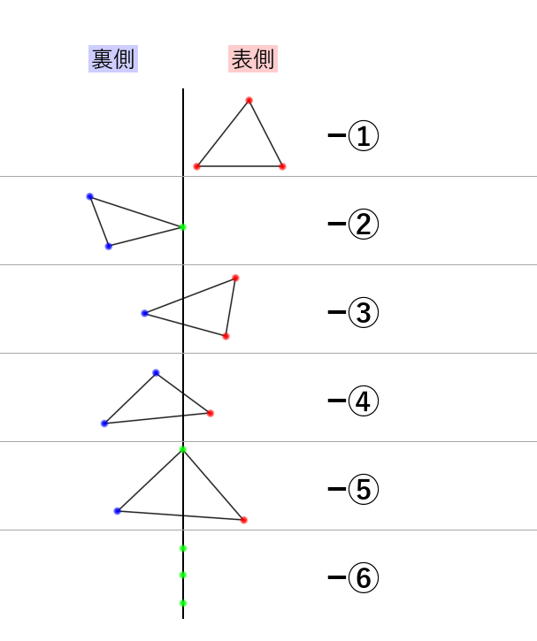  
  
ポリゴンが分割されていると判定された場合、表側の点と裏側の点を結んだ線分と切断面の交差地点を求め、  
新たな頂点バッファを作成する。  
  
  

分割の際には、後の切断面生成に備え、ポリゴンと切断面の交差地点上にある2つの頂点インデックスを1組のペアとして、集合に格納しておく。  

   
  
パターンに合わせて適切に表側、裏側のインデックスバッファに分割後のポリゴンの頂点インデックスを挿入するTriangleMakerクラスの関数を呼び出す。  
TriangleMakerクラスは、パターンの見落としや、新しいパターンが増えた時のために、  
抽象クラスであるITriangleMakerを継承して作成している。  

   

1つのマテリアル分のポリゴンに対して分割処理を繰り返す。  
分割の結果マテリアルのインデックスバッファのサイズが0になった場合、マテリアルを削除する。  
1マテリアル分が終われば次のマテリアル分のポリゴンに対して分割処理を行う。  

## 手順5.切断面の生成
全マテリアル分のポリゴンの分割が終わると、切断面の生成に入る。

切断面を生成する際、切断面を構成する頂点を新しく作成する必要がある。  
新しく作成する頂点は、座標自体はポリゴンの分割の時に得られた切断面上にある頂点と同じなので、  
作成された頂点インデックスのペアの集合を使用する。  

頂点インデックスのペアの集合を走査し、  
切断面上にある頂点の座標を新しく可変長配列に格納していく。
その後、頂点インデックスのペアを、頂点バッファの配列の何番目にあるかという情報から、  
切断面上にある頂点座標の可変長配列の何番目にあるかという情報に変換する。
(モデル全体の頂点バッファとインデックスバッファから、  
切断面上の点のみの頂点バッファとインデックスバッファを作り出すイメージ)

   

切断面上のみの頂点を変換し終えたら、切断面の形を決定していく。  
今回、切断面の生成には下記ページの多角形の三角形分割(耳分解)プログラム  
([http://www.prefield.com/algorithm/geometry/triangulate.html](http://www.prefield.com/algorithm/geometry/triangulate.html))  
を利用している。  
このプログラムでは、切断面を構成する頂点を反時計回りに並び替える必要がある。  
切断面上の点のみが得られていた場合、切断面の形を一つに決定することができない。  
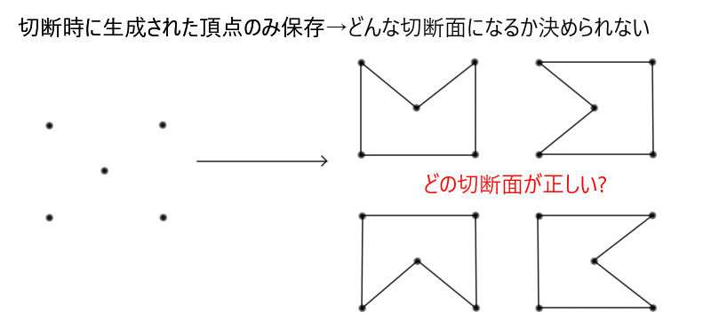   

そこで、ポリゴンを分割する時に作成した切断面上のインデックスのペアを使用する。  
ペアに格納されているのは、ポリゴンと切断面の交差地点上にある2つの頂点なので、  
2つの点を結んだ線分をつなげて一つのリンクを作る事で切断面の頂点を順番に並び替える事ができる。  

リンクの作成手順  
インデックスのペアを格納した集合を走査する。  

作成中のリンクがない場合最初のペアをリンクの始まりとする。  
リンクの最後の要素がインデックスのペアの中に含まれているかを探し、  
含まれていた場合、そのペアをリンクの最後尾に追加し集合から削除する。  
リンクの最初のインデックスと最後のインデックスが一致した場合、  
一つのループが完成しているので最後の要素を削除し、次のリンクを作成する。  

以上を集合の中身がなくなるまで繰り返し、リンクを作成する。

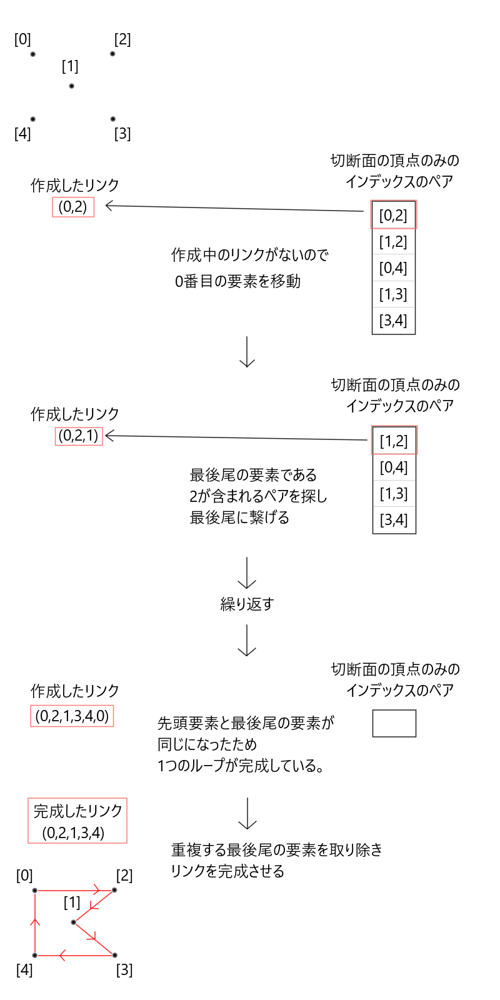  

今回使用する多角形の三角形分割(耳分解)プログラムは、  
2D座標上で三角形分割を行うプログラムであり、  
3D座標をそのまま使用することができない。  
そこで、切断面上の頂点の座標を、2D座標に変換する。  
まず、切断面上の任意の頂点を2つ選ぶ(今回は0番目と1番目の頂点)  
0番目から1番目の頂点へ向かうベクトルを正規化し、Xの基底軸とする。  
切断面の法線をZの基底軸とし、外積を計算してYの基底軸を求める。 

  

基底軸を計算した後、
切断面上のすべての頂点を基底変換する。  
Z軸の値がすべて同じになるため、XY軸の値のみを使う事で2D座標に変換できる。

2D座標空間には変換できたが、まだ頂点の順番が反時計回りであるという条件を必ず満たすとは限らない。  
そこで頂点の順番が反時計回りになっているかを判定する。  

2D座標上で一番Xの値の低い頂点を取得し、それをBとする。  
リンクを元にその前後にある頂点も取得し、前にある頂点をA、後にある頂点をCとする。  
AからBへのベクトルとAからCへのベクトルの外積を計算し、結果が0より大きければ反時計回りである。

  

 
時計回りと判定された場合、リンクの順番を反転させる。  

ここまでの操作で、三角形分割プログラムが使用できる  
2D座標系で、頂点が反時計回りであるという条件を満たしたため、  
頂点群に対して多角形の三角形分割を行うことで  
切断面を構成する点群を三角形に分割した際のインデックスを得る事ができる。  

取得した座標を元に、頂点バッファを作成する。
切断面の表側の頂点バッファの法線は切断面の法線を反転させたもの、  
切断面の裏側の頂点バッファの法線は切断面の法線を使用する。

以上で既存メッシュの切断、切断面の生成が終了となり、
モデルの切断が終了となる。

# **6.ディザリング透過**  

切断したモデルが消滅する際、ディザリング透過によって少しずつ透明化していくようにしている。  
   

<iframe width="560" height="315" src="https://www.youtube.com/embed/FzM-ni0sLRE" title="YouTube video player" frameborder="0" allow="accelerometer; autoplay; clipboard-write; encrypted-media; gyroscope; picture-in-picture" allowfullscreen></iframe>  

通常の透過処理  
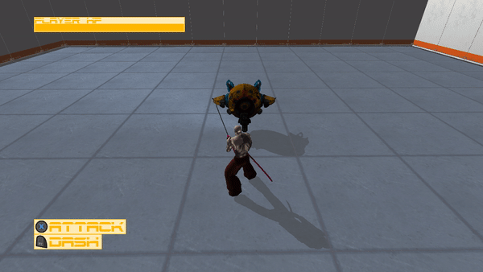  

ディザリングによる透過処理  
  

まず、事前にディザパターンと呼ばれる4✕4の二次元配列を定義しておく。  
  
シェーダー側でピクセルを描画する際、描画先のスクリーン座標のX座標とY座標を4で割った余剰を求め、  
全ピクセルをX座標ごとに4パターン、Y座標ごとに4パターンの計16パターンに分類しディザパターンに当てはめる。  
  
CPU側からディザリング透過の強さを定数バッファで送り、描画先ピクセルのディザパターンの値より  
ディザリング透過の強さの値の方が大きかった場合、ピクセルキルを行う。  
ディザリング透過の強さを少しずつ増加させていく事で徐々にディザリング透過が進行していく。  
  

# **7. こだわった部分**  

このゲームは敵の車体やミサイルなどを自由に切断できる事が他のゲームと違う一番の特徴である。  
切断機能を体験してもらうため、小さな敵やミサイルは通常攻撃で切断可能にし、  
ボス戦ではじっくりと方向を定めて切断ができるようにした。  
   
   

